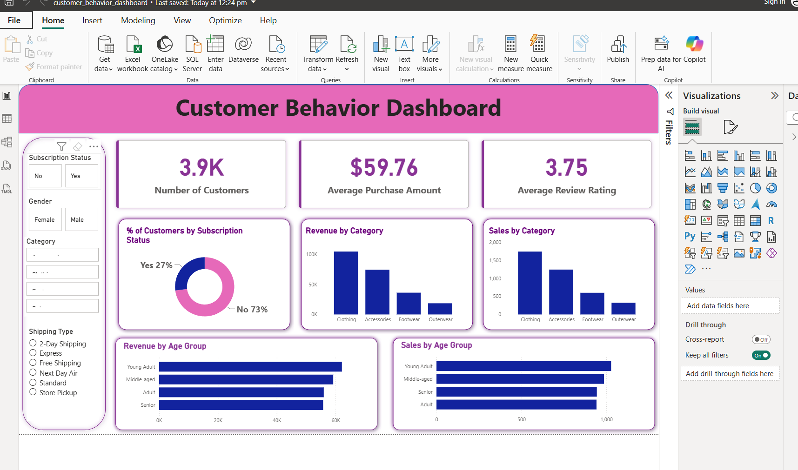

# Customer Shopping Behavior Analysis

## Project Overview

This project demonstrates an end-to-end data analytics workflow using **Python, SQL, and Power BI** to analyze customer shopping behavior. The objective is to transform raw retail transaction data into meaningful business insights through data cleaning, SQL analysis, and interactive dashboard visualization.

---

## Business Problem

Retail companies generate large amounts of customer transaction data. The challenge is to convert this raw data into actionable insights that improve customer satisfaction, marketing strategies, and sales performance.

This project answers questions such as:

* Which product categories generate the highest revenue?
* Do subscribers spend more than non-subscribers?
* Which products receive the highest customer ratings?
* How do discounts influence purchasing behavior?
* Which customer segments contribute the most revenue?

---

## Tech Stack

* Python
* Pandas
* NumPy
* SQL (PostgreSQL/MySQL)
* Power BI
* Git & GitHub

---

## Project Workflow

1. Data Collection
2. Data Cleaning using Pandas
3. Feature Engineering
4. Load Data into SQL
5. Business Analysis using SQL
6. Interactive Dashboard in Power BI
7. Business Insights & Recommendations

---

## Repository Structure

```text
Customer-Shopping-Behavior-Analysis/
│
├── data/
├── notebooks/
├── sql/
├── dashboard/
├── reports/
├── README.md
├── LICENSE
└── .gitignore
```

---

## SQL Business Questions

* Revenue by Gender
* Subscribers vs Non-Subscribers
* Top Rated Products
* Customer Segmentation
* Discount Analysis
* Revenue by Age Group

---

## Power BI Dashboard

The dashboard provides interactive visualizations including:

* Total Revenue KPI
* Average Purchase Amount
* Revenue by Category
* Revenue by Customer Segment
* Payment Method Analysis
* Seasonal Purchase Trends
* Customer Demographics
  
## Dashboard Preview


---

## Key Business Insights

* Customer segmentation helps identify loyal customers.
* Discounts influence purchasing behavior differently across products.
* Subscribers generally contribute higher overall revenue.
* Product ratings highlight customer preferences.
* Seasonal trends support inventory and marketing decisions.

---

## Future Enhancements

* Predict customer churn using Machine Learning.
* Build sales forecasting models.
* Deploy dashboards using Power BI Service.
* Automate ETL pipelines.

---

## Author

**Preethi**

Aspiring Data Analyst | Python | SQL | Power BI

